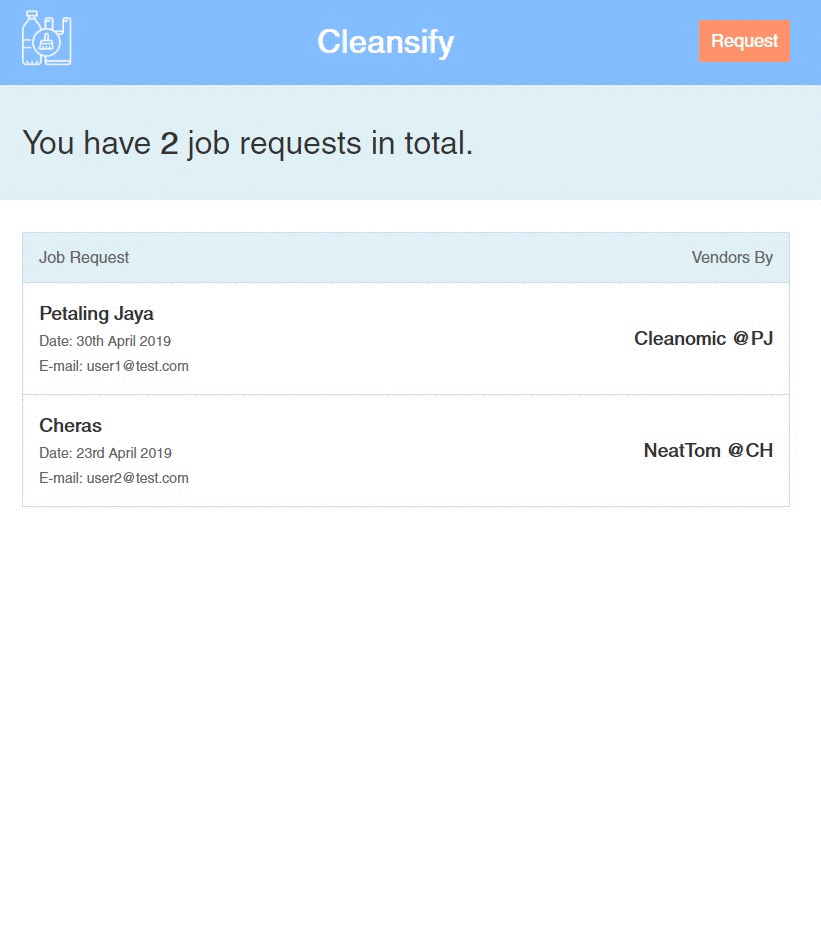
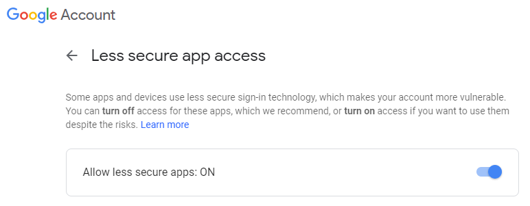
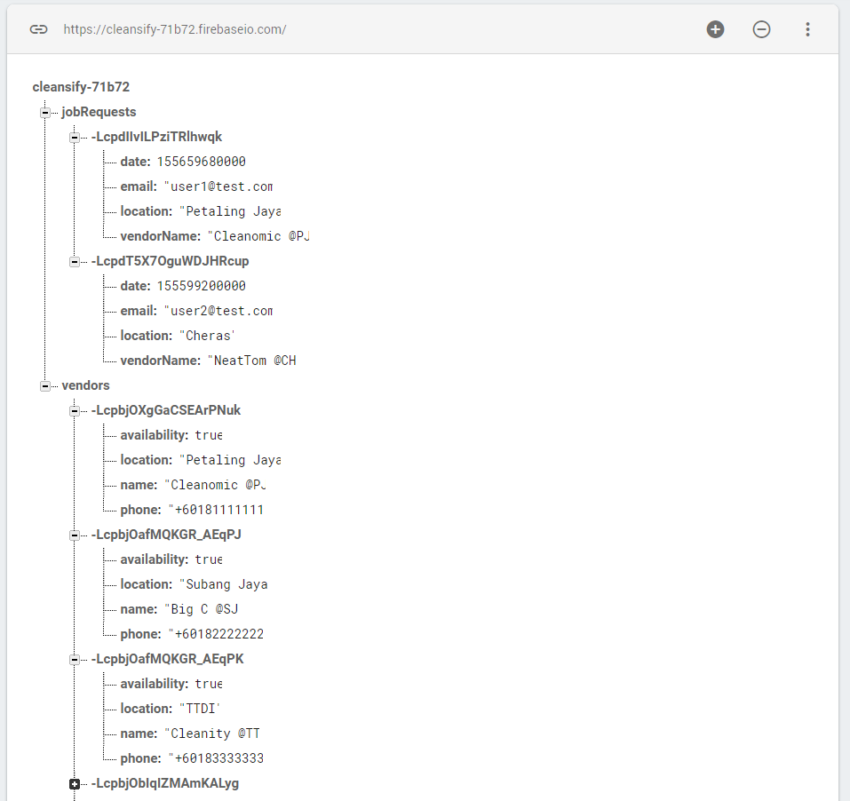
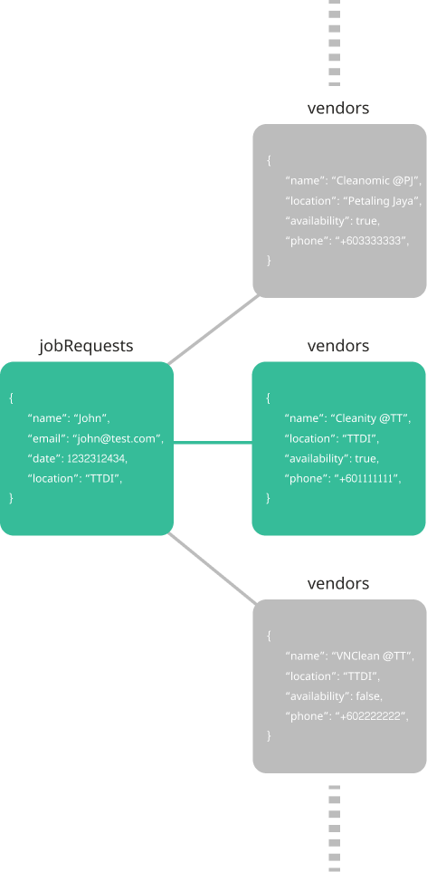

<br>
<br>
<br>

# Cleansify *(Working-In-Progress)*

Cleansify is a web application app which allows users to request cleaning services based on the time and location. It is built with Node.js, React and Firebase.  



## Table of contents

- [Getting Started](#getting-started)
    - [Installation](#installation)
- [Running Cleansify App](#running-cleansify-app)
- [Firebase Realtime Database](#firebase-realtime-database)
    - [Firebase Database Structure](#firebase-database-structure)
    - [Job Requests & Vendors Matching ](#job-requests-&-vendors-matching)
- [Deployment](#deployment)
- [Built With](#built-with)
- [Version](#version)
- [Authors](#authors)
- [Acknowledgments](#acknowledgments)


## Getting Started
[(Back to top)](#table-of-contents)

Node.js must be installed on local machine in order to run the app. If your local machine does not have Node.js installed, you can download and install from the officical [website](https://nodejs.org/en/download/).


### Installation

If you want to run the latest code from git, here's how to get started:

1. Clone the code:

        git clone https://github.com/theinhtut/cleansify.git
        cd cleansify

2. Install cleansify dependencies

        npm install

3. Create ".env.development" file under the root folder `cleansify/.env.development` with your own Firebase's credentials

        FIREBASE_API_KEY=XX
        FIREBASE_AUTH_DOMAIN=XX
        FIREBASE_DATABASE_URL=XX
        FIREBASE_PROJECT_ID=XX
        FIREBASE_STORAGE_BUCKET=XX
        FIREBASE_MESSAGING_SENDER_ID=XX
        GOOGLE_MAIL_USERNAME=xx@gmail.com
        GOOGLE_MAIL_PASSWORD=XX

4. You need to "Allow less secure apps: ON" temporarily in Google [here](https://myaccount.google.com/lesssecureapps).  
You can turn off later(Recommended)  


5. Build for production before getting start *(IMPORTANT)*

        npm run build:prod

6. Run

        npm start
   or

        node server/server.js

Once the server has started, you will see the following in your console.
```sh        
$ node server/server.js
Server is running on PORT 3000
```

## Running Cleansify App
[(Back to top)](#table-of-contents)

Everything is fully setup and now it is good to go. You can go to `http://localhost:3000` to use Cleansify.  
  

## Firebase Realtime Database
[(Back to top)](#table-of-contents)

If you want to setup your own database on Firebase, you must [sign up](https://firebase.google.com/) your google account first.  

### Firebase Database Structure
Firebase Realtime Database is a cloud-hosted database. Data is stored as JSON and synchronized in realtime to every connected client. 
The followings are the data structure stored inside Firebase Realtime Database.

<br>
<br>


### Job Requests & Vendors Matching 
Whenever users click on "Check Availability", it will find the availabe vendors based on two references:
-   User's input location is same with vendors' locations
-   Vendors' availability is `true`  



## Deployment
[(Back to top)](#table-of-contents)

Cleansify is now live on Heroku. You can visit [https://cleansify.herokuapp.com](https://cleansify.herokuapp.com)


## Built With
[(Back to top)](#table-of-contents)

* [Node.js](http://nodejs.org/) - Node.js® is a JavaScript runtime built on Chrome's V8 JavaScript engine.
* [React](https://reactjs.org) - React is a JavaScript library for building user interfaces. 
* [Firebase](https://firebase.google.com/) - Firebase is Google's mobile platform that helps you quickly develop high-quality apps and grow your business.
* [Webpack](https://webpack.js.org) - Webpack is a module bundler. Its main purpose is to bundle JavaScript files for usage in a browser.
* [Babel](https://babeljs.io) -Babel.js is a free and open-source JavaScript compiler and configurable transpiler used in web development.


## Version
[(Back to top)](#table-of-contents)

Cleansify v1.0.0

## Authors
[(Back to top)](#table-of-contents)

* **Thein Htut** - *Cleansify* - [Github](https://github.com/theinhtut)

See also the list of [contributors](https://github.com/theinhtut/cleansify/graphs/contributors) who participated in this project.


## Acknowledgments
[(Back to top)](#table-of-contents)

* Brillianda Sheravina - For inspiration by love ❤ and testing the web application
* To anyone whose codes were used as reference.
